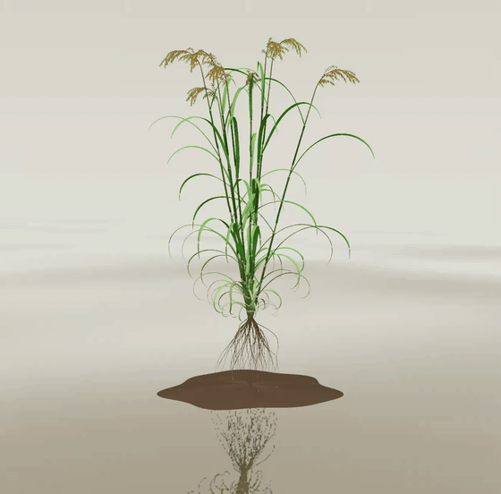

# Rice Plant Atlas



An interactive 3D atlas of a rice plant (*Oryza sativa*) built with React, Three.js, and shadcn/ui. A procedurally generated plant grows through a full **120-day season** in a reflective paddy scene, with **530 individually selectable organs** in **6 botanical systems**, from single awned grains on a panicle branch down to individual adventitious roots.

## Explore

- Orbit, zoom, and tap any organ on the plant to inspect it - with real morphometrics (blade length and width, internode diameter, grains per branch) in the detail panel.
- **Grow the plant**: scrub or play the season timeline from germination to maturity. Development runs on thermal time, phenology stages are named as you go, and a live **yield readout** (filled grains, grams per plant, t/ha) responds to everything below.
- **Stress the environment**: nitrogen, water, and temperature sliders drive source–sink responses - small pale panicles under low N, shrunken blades in drought, tiller suppression - and an optional **heat wave at flowering** sterilizes exactly the panicles whose flowering window it overlaps. Over-fertilized, well-watered canopies can lodge late in the season.
- **Photo mode**: a path-traced still of the current plant and paddy, with physically rendered water reflections, saveable as PNG.
- Toggle **figure labels**: textbook-style callouts naming the canonical organs, clickable and drawn with leader lines.
- Take the **guided tour** - "follow the grain" from the roots up through culms, sheaths, blades, the flag leaf, and the panicle, ending inside a grain.
- Toggle botanical systems (grains, panicle branches, leaf blades, sheaths, culms, roots) or use the Shoot / Panicle / Roots presets.
- Slide from the assembled plant to a spaced inventory of every organ.
- Search named structures - flag leaves, panicle rachises, ligules, the grain in cross-section.
- Isolate a selected organ and read a short botanical explanation.

## Run locally

Requires Node.js 22.13 or newer. No API keys or accounts are needed.

```sh
npm ci
npm run dev
```

Open http://localhost:3016. To build the static site, run `npm run build`; the output is in `dist/`.

## The plant model

The geometry is a functional-structural plant model generated entirely in code by `generate_fspm_rice.py`:

- A **tillering crown** with a main culm and seven tillers, each with tapered internodes, node bulges, and a slight outward lean.
- **Leaf sheaths** that wrap the culm and flare at the ligule, and **leaf blades** with a V-fold cross-section, longitudinal twist, and gracefully drooping tips - including short, erect flag leaves.
- **Nodding panicles**: an arching rachis with spirally arranged primary branches, secondary branchlets, and over a thousand individually placed awned grains on pedicels.
- A **fibrous root system** of 44 adventitious roots with fine laterals.
- **Per-organ color**: every organ carries its own tint - lower leaves and internodes age toward straw yellow, upper blades stay deep green, and each panicle ripens on its own schedule - rendered through a per-part color texture in the shader.
- **Finer organs**: a ligule-and-auricle collar at every sheath–blade junction, and a grain sliced in cross-section on the main culm's panicle, with the husk, endosperm, and embryo as separate selectable parts.
- **Four stages** from one parameterized generator - seedling, tillering, heading, maturity - each with its own architecture, organ counts, palettes, and panicle state. The viewer animates the maturity architecture continuously through the season; all four stages are exported as glTF.
- **Per-vertex shading**: every vertex carries a tint multiplier - base-to-tip blade gradients with senescent browned tips, dark node rings and waxy bloom on the internodes, roots darkening toward the crown, and grains ripening basally-first along each branch.
- **Surface detail**: parallel-vein corrugation and a keeled midrib on every blade, five lemma ridges on every grain, culms that kink slightly at each node, a spent seed on the seedling's crown, and senesced brown leaves hanging at maturity.
- **A living paddy**: the plant stands on a mud hummock in still water that mirrors it to a fogged horizon, under a gradient sky whose light follows the season - cool clear mornings while the crop is vegetative, a high neutral sun mid-season, low amber light as the grain ripens. Pollen motes drift on the wind and thicken around anthesis.
- **Rendering**: soft shadow mapping (with a custom depth pass so hidden organs cast no shadows), per-system material finish, backlit-leaf translucency, HDR bloom that steps aside in the technical atlas and isolate views, eased cinematic camera moves, and a gentle idle wind that stills when you isolate an organ (and honors reduced-motion preferences).

Proportions and architecture follow the real plant, but this is a conceptual educational model, not a scan of a specimen.

## Rebuilding geometry

```sh
python3.11 -m venv .venv-bpy && .venv-bpy/bin/pip install bpy   # once
python3 generate_fspm_rice.py
for s in seedling tillering heading maturity; do
  .venv-bpy/bin/python scripts/blender_refine.py rice_obj_$s rice_obj_${s}_ref
  .venv-bpy/bin/python scripts/bake_ao.py rice_obj_${s}_ref rice_obj_${s}_ao
  python3 scripts/convert-anatomy.py rice_obj_${s}_ao concept_map_$s.json system_map_$s.json atlas-$s
done
node scripts/compress-models.mjs
```

Each stage is also available as a portable glTF binary in `exports/` (`rice-<stage>.glb`, Draco-compressed) - usable directly in Blender, Unity, Unreal, Godot, or any glTF viewer. Every organ is a named node carrying `organ_id`, `system`, and `concept` extras, grouped into per-system collections, with the base color, per-vertex tints, and baked ambient occlusion folded into real `COLOR_0` vertex colors and per-system PBR materials. Regenerate with:

```sh
for s in seedling tillering heading maturity; do
  .venv-bpy/bin/python scripts/export_gltf.py $s
  npx @gltf-transform/cli draco exports/rice-$s.glb exports/rice-$s.glb
done
```

The generator writes one OBJ per organ into `rice_obj_<stage>/` plus per-stage concept and system maps. A headless Blender (`bpy`) stage then gives leaf blades real thickness via a Solidify modifier (other organs pass through untouched), and an ambient-occlusion bake raycasts the whole assembled plant with Blender's BVH to darken per-vertex tints where organs shade each other - sheath–culm contacts, the canopy interior, panicle cores, the root-mass center. The converter accepts both the raw and the Blender-refined OBJ indexing and packs each stage into binary chunks under `public/models/` as `atlas-<stage>.json` + `atlas-<stage>-N.bin`.

## How it works

Geometry is merged into batches per system. Per-organ GPU textures control translation, visibility, and selection, while component geometry supports accurate picking. Exploded layouts pack only the visible organs, and rendering updates only when the scene changes.

## Deploy

Import this repository into Vercel as a Vite project. The included `vercel.json` configures `npm ci`, `npm run build`, and the `dist` output directory. It can also be served by a static host.

## License

Released under the [MIT License](LICENSE). The viewer is adapted from the open-source Human Atlas; the plant geometry is original procedural output of this repository.
